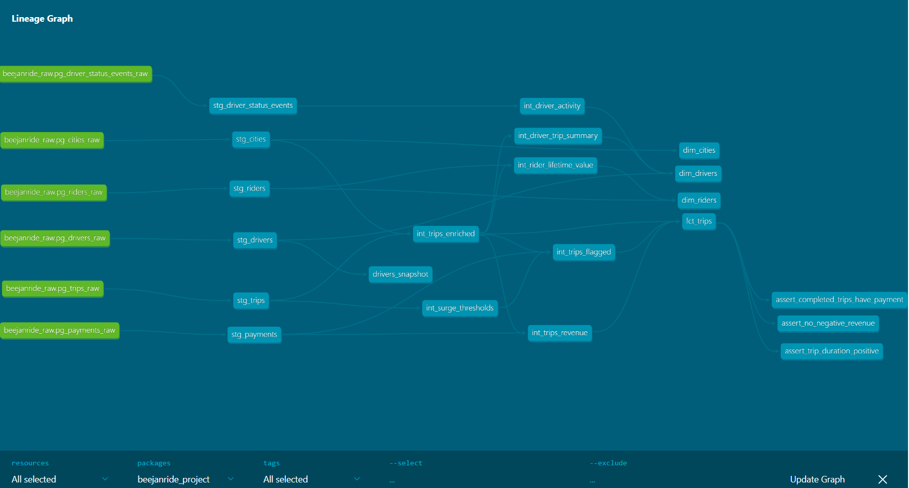

# BeejanRide Analytics Platform

A production-grade data transformation layer built with dbt Core for BeejanRide, a UK mobility startup operating ride-hailing, airport transfers, and scheduled corporate rides across 5 cities.

---

## Table of Contents

- [Architecture Overview](#architecture-overview)
- [Data Flow](#data-flow)
- [ERD](#erd)
- [Project Structure](#project-structure)
- [Lineage Graph](#lineage-graph)
- [Layer Descriptions](#layer-descriptions)
- [Incremental Models](#incremental-models)
- [Data Quality](#data-quality)
- [Snapshots](#snapshots)
- [Design Decisions](#design-decisions)
- [Tradeoffs](#tradeoffs)
- [Sample Analytical Queries](#sample-analytical-queries)
- [Future Improvements](#future-improvements)
- [Setup & Running the Project](#setup--running-the-project)

---

## Architecture Overview

```
PostgreSQL (Source)
      │
      ▼
   Airbyte (Incremental Sync)
      │
      ▼
BigQuery Raw Layer  ──────────────────────────────────────────┐
(beejanride_raw_dataset)                                      │
      │                                                       │
      ▼                                                       │
Staging Layer                                                 │
(dbt_BeejanRide_staging)                                      │
      │                                                       │
      ▼                                                       │
Intermediate Layer                                            │
(dbt_BeejanRide_int_*)                                        │
      │                                                       │
      ▼                                                       │
Marts Layer  ◄────────────────────────────────────────────────┘
(dbt_BeejanRide_marts)
      │
      ▼
Dashboards & Analytics
```

**Technology Stack:**
- **Ingestion:** Airbyte (incremental sync from PostgreSQL)
- **Warehouse:** Google BigQuery
- **Transformation:** dbt Core 1.11
- **Version Control:** Git & GitHub

---

## Data Flow

1. **Airbyte** pulls new and updated records from the PostgreSQL transactional database using incremental sync and lands them in the BigQuery raw layer unchanged.

2. **Staging models** clean, deduplicate, cast correct types, and standardize timestamps on each raw table. Raw tables are never modified.

3. **Intermediate models** apply business logic — trip enrichment, revenue calculations, fraud detection, driver metrics, and rider lifetime value. These models are reusable building blocks that multiple marts can reference.

4. **Mart models** implement a star schema (fact + dimension tables) that directly supports dashboards and analytical queries.

---

## ERD

### Raw Layer ERD

This shows the relationships between source tables as they arrive from PostgreSQL via Airbyte.

```
cities_raw          riders_raw
    │                   │
    │                   │
    └──────┐    ┌───────┘
           │    │
         trips_raw ──────── payments_raw
           │
    ┌──────┘
    │
drivers_raw ──── driver_status_events_raw
```

### Marts Layer ERD (Star Schema)

This is what analysts and dashboards actually query. See `erd_marts.html` in the repository for the full interactive version.

```
                    dim_drivers
                   (driver_id PK)
                    driver_status
                    total_revenue
                    completion_rate_pct
                    total_online_hours
                    is_churned
                         │
                         │ driver_id FK
                         │
dim_cities ──────── fct_trips ──────── dim_riders
(city_id PK)       (trip_id PK)       (rider_id PK)
city_name          driver_id FK        signup_date
country            rider_id FK         country
launch_date        city_id FK          total_spent
                   trip_date           avg_fare_per_trip
                   trip_status         is_active
                   net_revenue         days_to_first_trip
                   gross_revenue
                   surge_multiplier
                   is_revenue_realised
                   fraud_signal_score
                   risk_tier
```

### Raw Tables

| Table | Description | Key Columns |
|---|---|---|
| `trips_raw` | Every trip requested on the platform | trip_id, rider_id, driver_id, status, actual_fare, surge_multiplier |
| `drivers_raw` | Driver profile and current status | driver_id, driver_status, city_id, rating |
| `riders_raw` | Rider signup and profile data | rider_id, signup_date, country |
| `payments_raw` | Payment records linked to trips | payment_id, trip_id, payment_status, amount, fee |
| `cities_raw` | City reference data | city_id, city_name, country |
| `driver_status_events_raw` | High-volume driver online/offline events | event_id, driver_id, status, event_timestamp |

---

## Project Structure

```
BeejanRide_project/
├── models/
│   ├── staging/
│   │   ├── _sources.yml
│   │   ├── _stg_schema.yml
│   │   ├── stg_trips.sql
│   │   ├── stg_drivers.sql
│   │   ├── stg_riders.sql
│   │   ├── stg_payments.sql
│   │   ├── stg_cities.sql
│   │   └── stg_driver_status_events.sql
│   ├── intermediate/
│   │   ├── operations/
│   │   │   ├── _int_operations__models.yml
│   │   │   ├── int_trips_enriched.sql
│   │   │   ├── int_trips_flagged.sql
│   │   │   └── int_surge_thresholds.sql
│   │   ├── finance/
│   │   │   ├── _int_finance__models.yml
│   │   │   └── int_trips_revenue.sql
│   │   ├── drivers/
│   │   │   ├── _int_drivers__models.yml
│   │   │   ├── int_driver_trip_summary.sql
│   │   │   └── int_driver_activity.sql
│   │   └── riders/
│   │       ├── _int_riders__models.yml
│   │       └── int_rider_lifetime_value.sql
│   └── marts/
│       ├── _marts__models.yml
│       ├── fct_trips.sql
│       ├── dim_drivers.sql
│       ├── dim_riders.sql
│       └── dim_cities.sql
├── snapshots/
│   └── drivers_snapshot.sql
├── macros/
│   ├── deduplicate.sql
│   └── standardize_timestamp.sql
├── tests/
│   ├── assert_no_negative_revenue.sql
│   ├── assert_trip_duration_positive.sql
│   └── assert_completed_trips_have_payment.sql
├── dbt_project.yml
└── README.md
```

---

## Lineage Graph



The lineage graph shows the full data flow from raw BigQuery sources (green) through staging and intermediate models (teal) to the final mart tables and custom tests (right). Every dependency is explicit through `ref()` — no hardcoded table names exist anywhere in the project.

---

## Layer Descriptions

### Staging Layer

One model per raw source table. Each staging model:
- Removes rows with null primary keys
- Casts columns to correct data types
- Standardizes timestamps using the `standardize_timestamp` macro
- Deduplicates using the `deduplicate` macro on primary key + latest `updated_at`
- Lowercases categorical values (status, payment_method, etc.)

High-volume tables (`stg_trips`, `stg_payments`, `stg_driver_status_events`) are materialized as **incremental tables** to avoid reprocessing historical data on every run.

### Intermediate Layer

Organized by business domain:

| Domain | Models | Purpose |
|---|---|---|
| operations | `int_trips_enriched` | Core trip spine — adds city context, duration, surge breakdown |
| operations | `int_surge_thresholds` | Computes p95/p99 surge percentiles once as a table |
| operations | `int_trips_flagged` | Rule-based fraud detection — 5 signals, scored per trip |
| finance | `int_trips_revenue` | Net revenue, gross revenue, payment availability per trip |
| drivers | `int_driver_trip_summary` | Lifetime trips, revenue, churn flag per driver |
| drivers | `int_driver_activity` | Online hours using LEAD() window function on status events |
| riders | `int_rider_lifetime_value` | Total spend, trip counts, activity status per rider |

### Marts Layer — Star Schema

```
        dim_drivers
             │
dim_cities ──┼── fct_trips ── dim_riders
             │
         dim_cities
```

| Model | Type | Description |
|---|---|---|
| `fct_trips` | Fact | One row per trip. Core analytics table combining enrichment, revenue, and fraud signals |
| `dim_drivers` | Dimension | Driver profile + lifetime performance + online activity |
| `dim_riders` | Dimension | Rider profile + lifetime value metrics |
| `dim_cities` | Dimension | City reference data |

---

## Incremental Models

### Why Incremental?

`stg_trips`, `stg_payments`, and `stg_driver_status_events` grow continuously as BeejanRide processes rides daily. Rebuilding these tables fully on every dbt run would reprocess millions of historical rows unnecessarily, increasing both cost and run time.

Incremental materialization means dbt only processes rows newer than the latest `updated_at` (or `event_timestamp`) already present in the table.

### How It Works

```sql

    and updated_at > (select max(updated_at) from {{ this }})

```

On the **first run**, `is_incremental()` is false — dbt builds the full table.  
On **subsequent runs**, only new or updated rows are processed and upserted via `unique_key`.

### Full Refresh vs Incremental

| | Full Refresh | Incremental |
|---|---|---|
| Correctness | Guaranteed — rebuilds everything from source | Can miss late-arriving data older than current max timestamp |
| Cost | Higher — scans entire source table | Lower — scans only new rows |
| Run time | Slower as data grows | Stays fast regardless of historical data size |
| When to use | After logic changes, schema changes, or suspected data issues | Normal daily/hourly production runs |

### Models Designed for Incremental (Currently Commented Out)

Three models in this project were deliberately designed with incremental materialization in mind but are currently running as `table` due to BigQuery free tier restrictions — the free tier does not support the DML operations (`MERGE`/`INSERT`) that incremental models require.

The incremental config blocks exist in each model but are commented out. When BigQuery billing is enabled, simply uncomment the config blocks and the incremental filter in each model to activate production-ready behaviour:

**`int_trips_enriched.sql`**, **`int_trips_revenue.sql`**, **`fct_trips.sql`** — all contain:

```sql
-- INCREMENTAL CONFIG (uncomment when BigQuery billing is enabled)
-- materialized='incremental',
-- unique_key='trip_id',
-- on_schema_change='sync_all_columns',
```

and:

```sql
-- INCREMENTAL FILTER (uncomment when BigQuery billing is enabled)
-- 
--     and updated_at > (select max(updated_at) from {{ this }})
-- 
```

This approach was chosen deliberately — rather than removing the incremental design entirely, the commented blocks document the production intent and make the upgrade path a one-step change per model.

---

## Data Quality

### Generic Tests (via YAML)

Applied across all layers:
- `not_null` — primary keys, foreign keys, and critical business columns
- `unique` — all primary keys
- `relationships` — foreign key integrity (e.g. every trip's driver_id exists in stg_drivers)
- `accepted_values` — categorical columns (status, payment_method, risk_tier, etc.)

### Custom Singular Tests

| Test | File | What It Checks |
|---|---|---|
| No negative revenue | `assert_no_negative_revenue.sql` | No realised trip has net_revenue < 0 |
| Positive trip duration | `assert_trip_duration_positive.sql` | No completed trip has duration ≤ 0 minutes |
| Payment on completion | `assert_completed_trips_have_payment.sql` | Every completed trip has a successful payment |

### Source Freshness

`trips_raw` freshness is monitored in `_sources.yml`. A warning is raised if data is older than 1 hour and an error if older than 2 hours, ensuring the pipeline detects ingestion failures quickly.

### Test Results

```
129 tests | 129 passed | 0 failed | 0 warnings
```

---

## Snapshots

`drivers_snapshot` implements **SCD Type 2** on the drivers table using dbt's snapshot strategy.

**Tracks changes to:**
- `driver_status` (active / suspended / inactive)
- `vehicle_id` (vehicle reassignments)
- `rating` (rating updates)

**How it works:**  
On each snapshot run, dbt compares the current state of `stg_drivers` with the snapshot table. If any tracked column has changed for a driver, the old record is closed (`dbt_valid_to` is set) and a new record is inserted with the updated values and a new `dbt_valid_from` timestamp.

This allows historical analysis like "what was this driver's status on a specific date?" without losing any historical state.

---

## Design Decisions

**1. Separation of revenue and operations logic**  
Revenue calculations (net revenue, payment fees, revenue type) live in `finance/int_trips_revenue` rather than in `int_trips_enriched`. This keeps the core trip spine focused on operational data and makes it easier to update revenue logic independently.

**2. Percentile-based fraud detection**  
Rather than a fixed threshold for surge fraud detection, the project uses `APPROX_QUANTILES` to compute p95 and p99 thresholds dynamically from the actual data. These are computed once in `int_surge_thresholds` and cross-joined into `int_trips_flagged` to avoid repeated full table scans. A hard cap of 10x is also applied as an absolute safety net.

**3. Fraud scoring over binary flags**  
Each trip receives a `fraud_signal_score` (0–5) and a `risk_tier` (clean/low/medium/high) rather than a single binary fraud flag. This allows analysts to prioritise investigations and avoids false positives from a single misfired signal.

**4. Left joins over inner joins throughout**  
All joins in intermediate and mart models use `LEFT JOIN` so that no trips are silently dropped due to missing dimension records. Missing joins produce null values, which are visible and testable — unlike rows that disappear with an inner join.

**5. One schema per intermediate domain**  
Intermediate models are split across four BigQuery schemas (`int_finance`, `int_operations`, `int_drivers`, `int_riders`). This makes access control easier in production and keeps datasets navigable as the project grows.

---

## Tradeoffs

**Incremental vs full refresh**  
Incremental models are faster and cheaper in production but introduce complexity. Late-arriving data (records inserted into the source after the current max timestamp) can be missed unless a lookback window is added. For this project, we accept that tradeoff given the volume of trips data.

**Rule-based fraud detection**  
The fraud model uses fixed business rules rather than machine learning. This makes it transparent, testable, and easy to explain — but it will miss sophisticated fraud patterns that don't trigger any of the five signals. A future improvement would be to feed `fct_trips` fraud signals into an ML model.

**No `fct_revenue` or `fct_driver_performance` tables**  
These were initially planned as separate fact tables but were removed because they would be simple aggregations of `fct_trips`. Adding them would introduce redundancy without adding value at this data scale. Dashboard queries can group `fct_trips` directly.

**BigQuery free tier**  
`fct_trips` uses `table` materialization instead of `incremental` because BigQuery's free tier does not support DML operations (MERGE/INSERT). This means the full trips table is rebuilt on every run. In production with billing enabled, this should be the first model converted to incremental.

---

## Sample Analytical Queries

### 1. Daily Revenue Per City

```sql
select
    trip_date,
    city_id,
    count(trip_id)                                              as total_trips,
    countif(is_revenue_realised)                               as paid_trips,
    round(sum(case when is_revenue_realised
        then net_revenue end), 2)                              as total_net_revenue,
    round(sum(case when is_revenue_realised
        then gross_revenue end), 2)                            as total_gross_revenue
from `beejanride-project.dbt_BeejanRide_marts.fct_trips`
group by 1, 2
order by 1 desc, 3 desc
```

### 2. Corporate vs Personal Revenue Split

```sql
select
    revenue_type,
    count(trip_id)                                             as total_trips,
    round(sum(case when is_revenue_realised
        then net_revenue end), 2)                              as total_net_revenue,
    round(avg(case when is_revenue_realised
        then net_revenue end), 2)                              as avg_net_revenue_per_trip
from `beejanride-project.dbt_BeejanRide_marts.fct_trips`
group by 1
```

### 3. Top Drivers by Revenue

```sql
select
    driver_id,
    total_trips,
    completed_trips,
    total_revenue,
    completion_rate_pct,
    total_online_hours,
    is_churned
from `beejanride-project.dbt_BeejanRide_marts.dim_drivers`
order by total_revenue desc
limit 10
```

### 4. Rider Lifetime Value Analysis

```sql
select
    is_active,
    count(rider_id)                        as rider_count,
    round(avg(total_spent), 2)             as avg_lifetime_spend,
    round(avg(completed_trips), 1)         as avg_completed_trips,
    round(avg(days_to_first_trip), 0)      as avg_days_to_first_trip
from `beejanride-project.dbt_BeejanRide_marts.dim_riders`
where total_trips is not null
group by 1
```

### 5. Payment Failure Rate

```sql
select
    payment_provider,
    count(trip_id)                                             as total_payments,
    countif(payment_status = 'failed')                        as failed_payments,
    round(countif(payment_status = 'failed')
        / count(trip_id) * 100, 2)                            as failure_rate_pct
from `beejanride-project.dbt_BeejanRide_marts.fct_trips`
where payment_status is not null
group by 1
```

### 6. Surge Impact Analysis

```sql
select
    is_surge,
    count(trip_id)                                             as total_trips,
    round(avg(surge_multiplier), 2)                           as avg_surge_multiplier,
    round(sum(surge_revenue_impact), 2)                       as total_surge_revenue,
    round(avg(surge_revenue_impact), 2)                       as avg_surge_per_trip
from `beejanride-project.dbt_BeejanRide_marts.fct_trips`
where trip_status = 'completed'
group by 1
```

### 7. Fraud Monitoring View

```sql
select
    risk_tier,
    count(trip_id)                                             as trip_count,
    countif(is_extreme_surge)                                 as extreme_surge_count,
    countif(is_completed_with_failed_payment)                 as failed_payment_count,
    countif(has_duplicate_payment)                            as duplicate_payment_count,
    countif(is_suspicious_duration)                           as suspicious_duration_count,
    countif(is_zero_fare_completed)                           as zero_fare_count
from `beejanride-project.dbt_BeejanRide_marts.fct_trips`
group by 1
order by 2 desc
```

### 8. Driver Churn Tracking

```sql
select
    is_churned,
    driver_status,
    count(driver_id)                                           as driver_count,
    round(avg(days_since_last_trip), 0)                       as avg_days_inactive,
    round(avg(total_trips), 1)                                as avg_lifetime_trips
from `beejanride-project.dbt_BeejanRide_marts.dim_drivers`
group by 1, 2
order by 1 desc, 3 desc
```

---

## Future Improvements

1. **Enable incremental materialization on `fct_trips`** once billing is enabled on BigQuery. This is the single highest-impact performance improvement available.

2. **Add a lookback window to incremental models** to handle late-arriving data. Currently if a record arrives in the source with an `updated_at` older than the current max, it will be missed until a full refresh is run.

3. **Expand fraud detection signals** — current signals are rule-based. Feeding `fct_trips` fraud scores into an ML model (e.g. BigQuery ML) would catch more sophisticated patterns.

4. **Add a date dimension table (`dim_dates`)** for easier time-series analysis in BI tools that require explicit date spine joins.

5. **Add driver-city performance breakdowns** in the marts layer to support city-level profitability analysis per driver.

6. **Implement dbt exposures** to document which dashboards consume which mart models, completing the full governance picture.

7. **Set up dbt Cloud or Airflow scheduling** so the pipeline runs automatically on a schedule rather than requiring manual `dbt run` commands.
